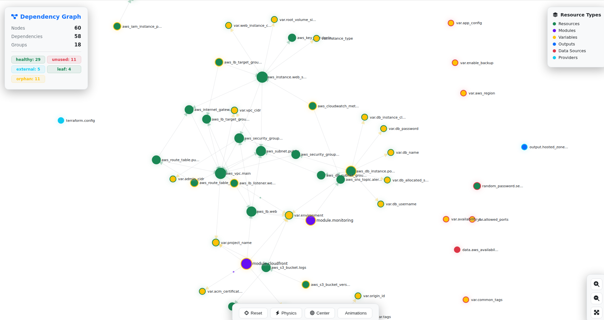
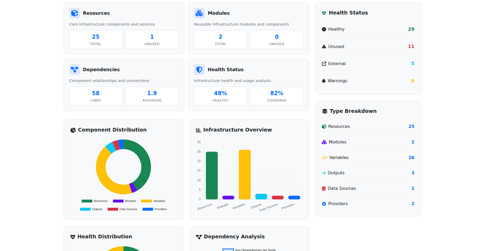
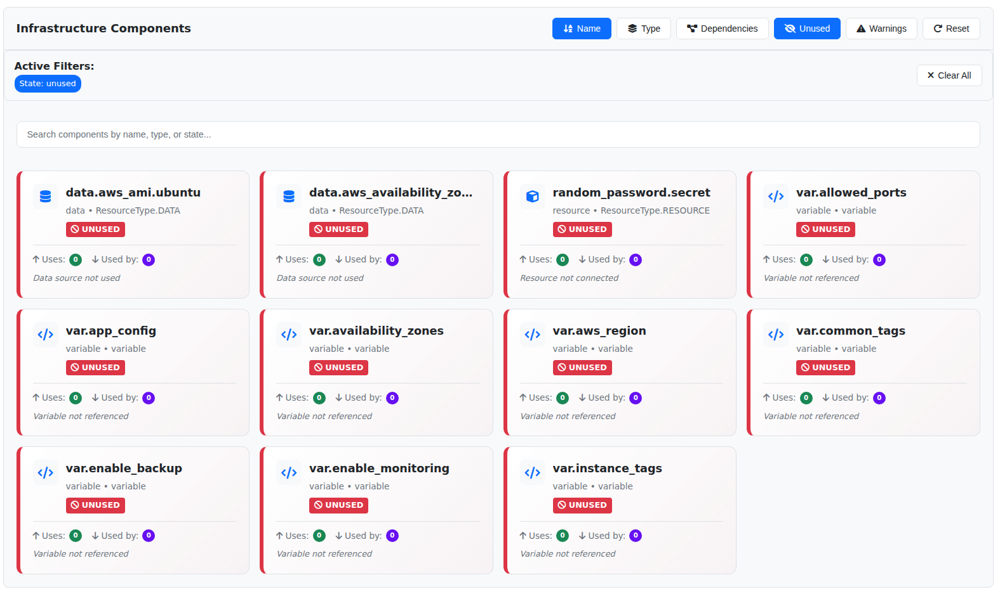

# TFKit - Terraform Intelligence & Analysis Suite

[](https://www.python.org/downloads/)
[](LICENSE)
[](https://github.com/your-org/tfkit)

A comprehensive toolkit for analyzing, visualizing, and validating Terraform infrastructure code. TFKit provides deep insights into your Terraform projects with advanced dependency tracking, security scanning, and interactive visualizations.

## Overview

TFKit helps infrastructure teams understand, validate, and optimize their Terraform configurations through:

- **Detailed Analysis**: Deep dependency mapping and resource relationship tracking
- **Multi-Format Export**: Flexible output formats for integration with other tools
- **Interactive Visualizations**: Rich graphical representations of your infrastructure
- **Security Validation**: Built-in security scanning and compliance checks
- **CI/CD Ready**: SARIF output and automation-friendly interfaces

## Quick Start

### Installation

```bash
pip install tfkit
```

### Basic Usage

Get started with these common commands:

```bash
# Quick project scan
tfkit scan

# Deep analysis with all features
tfkit analyze --deep --include-dependencies --include-security --include-costs

# Generate interactive report
tfkit report --interactive --open

# Validate configurations
tfkit validate --all --strict
```

## Visualizations

TFKit provides multiple visualization layouts to suit different analysis needs:

<div align="center">

|                    Graph Layout                     |                   Dashboard Layout                    |                  Classic Layout                   |
| :-------------------------------------------------: | :---------------------------------------------------: | :-----------------------------------------------: |
|        |  |  |
| Force-directed graph showing resource relationships |          Dashboard with metrics and insights          |          Traditional hierarchical layout          |

</div>

## Command Reference

### Scan Command

Quick analysis for rapid insights into your Terraform project.

```bash
tfkit scan [PATH] [OPTIONS]
```

**Examples:**

```bash
# Scan current directory
tfkit scan

# Scan with JSON output
tfkit scan /path/to/terraform --format json

# Scan and open visualization
tfkit scan --open --theme dark --layout graph
```

### Analyze Command

Deep analysis with detailed feature set for detailed infrastructure understanding.

```bash
tfkit analyze [PATH] [OPTIONS]
```

**Key Options:**

- `--deep, -d` - Enable deep analysis with dependency tracking
- `--include-dependencies, -D` - Analyze module dependencies
- `--include-security, -S` - Include security analysis
- `--include-costs, -C` - Include cost estimation
- `--export-json FILE` - Export analysis as JSON
- `--export-markdown FILE` - Generate Markdown report

**Examples:**

```bash
# Full analysis with all features
tfkit analyze --deep -D -S -C --open-browser

# Security-focused analysis
tfkit analyze --include-security --export-markdown security-report.md

# AWS-specific analysis
tfkit analyze --providers aws --tags production
```

### Inspect Command

Detailed inspection of specific Terraform components with dependency tracking.

```bash
tfkit inspect COMPONENT_TYPE [PATH] [OPTIONS]
```

**Available Component Types:**

- `resource` - Terraform resources
- `module` - Module configurations
- `variable` - Input variables
- `output` - Output values
- `provider` - Provider configurations
- `data` - Data sources
- `local` - Local values
- `terraform` - Terraform configuration blocks

**Examples:**

```bash
# Inspect all resources
tfkit inspect resource

# Inspect specific resource with dependencies
tfkit inspect resource --name aws_instance.web --show-dependencies

# Inspect modules with detailed metadata
tfkit inspect module --show-attributes --show-metadata --format table
```

### Report Command

Generate detailed reports in multiple formats with customizable themes.

```bash
tfkit report [PATH] [OPTIONS]
```

**Report Types:**

- `summary` - High-level overview (default)
- `detailed` - Detailed analysis
- `security` - Security and compliance focus
- `cost` - Cost analysis and optimization
- `compliance` - Compliance and best practices

**Output Formats:**

- `html` - Interactive HTML (default)
- `pdf` - PDF document
- `markdown` - Markdown document
- `json` - Structured JSON data

**Examples:**

```bash
# Interactive HTML report
tfkit report --type detailed --interactive --open

# PDF security report
tfkit report --type security --format pdf -o security-report.pdf

# Custom themed report
tfkit report --title "Production Infrastructure" --theme cyber
```

### Export Command

Export analysis data in multiple structured formats for integration with other tools.

```bash
tfkit export [PATH] [OPTIONS]
```

**Supported Formats:**

- `json` - JSON format (standard)
- `yaml` - YAML format (human-readable)
- `csv` - CSV format (spreadsheet-compatible)
- `xml` - XML format (legacy systems)
- `toml` - TOML format (config files)

**Examples:**

```bash
# Export as JSON and YAML
tfkit export --format json --format yaml

# Split exports by provider
tfkit export --format csv --split-by provider

# Export with compression
tfkit export --format json --format yaml --compress
```

### Validate Command

Comprehensive validation of Terraform configurations with multiple check types.

```bash
tfkit validate [PATH] [OPTIONS]
```

**Validation Checks:**

- `--check-syntax` - HCL syntax validation
- `--check-references` - Reference validation
- `--check-best-practices` - Best practices compliance
- `--check-security` - Security configuration checks
- `--all, -a` - Run all validation checks

**Examples:**

```bash
# Full validation suite
tfkit validate --all

# CI/CD integration with SARIF output
tfkit validate --all --strict --fail-on-warning --format sarif

# Targeted validation
tfkit validate --check-syntax --check-references --check-security
```

## Advanced Usage

### Complete Analysis Pipeline

```bash
# 1. Initial project scan
tfkit scan --save initial-scan.json

# 2. Deep analysis with all features
tfkit analyze --deep -D -S -C --export-json detailed.json

# 3. Generate comprehensive report
tfkit report --type detailed --include-graph --open

# 4. Export data for external tools
tfkit export --format json --format yaml --compress
```

### Security-Focused Workflow

```bash
# Security analysis and data collection
tfkit analyze --include-security --export-json security-data.json

# Security validation
tfkit validate --check-security --strict

# Security report generation
tfkit report --type security --format pdf
```

### CI/CD Integration

```bash
# Pre-commit validation
tfkit validate --check-syntax --check-references --fail-on-warning

# SARIF output for GitHub Actions
tfkit validate --all --format sarif > results.sarif

# Automated scanning
tfkit scan --quiet --format json --save scan-results.json
```

### Configuration Management

```bash
# View current configuration
tfkit config --show

# Set default theme
tfkit config --set theme=dark

# Set default output format
tfkit config --set default_format=json

# Edit configuration in default editor
tfkit config --edit
```

## Visualization Features

### Available Themes

- **Dark** (default) - Dark theme for extended viewing sessions
- **Light** - Light theme for printed reports and documentation
- **Cyber** - High-contrast theme for presentations
- **Nord** - Nord color scheme for consistent styling

### Layout Options

- **Classic** - Traditional hierarchical tree layout
- **Graph** - Force-directed graph for complex relationships
- **Dashboard** - Metrics-focused layout with key insights

## Project Structure

```
tfkit/
├── analyzer/           # Terraform analysis components
│   ├── models.py      # Data models and types
│   └── terraform_analyzer.py
├── validator/         # Validation engine
│   ├── models.py      # Validation models
│   └── validator.py   # Core validation logic
├── visualizer/        # Visualization components
│   └── html_generator.py
├── cli/              # Command-line interface
│   └── main.py       # CLI entry point
└── utils/            # Utility functions
```

## Output Examples

### Scan Results

```bash
$ tfkit scan
```

```
Analysis Summary
──────────────────────────────────────────────────
Category        Count   Details
──────────────────────────────────────────────────
Resources       24      aws_instance: 5
Data Sources    3
Modules         2       2 modules detected
Variables       12
Outputs         8
Providers       3       aws, null, template
──────────────────────────────────────────────────
```

### Validation Results

```bash
$ tfkit validate --all
```

```
Validation Complete: 45 passed, 3 warnings, 1 errors

Errors
─────────────────────────────────────────────────────────────────────
Severity   Category   Rule    Location    Resource   Message
─────────────────────────────────────────────────────────────────────
ERROR      Security   TF101   main.tf:15            Missing security group
─────────────────────────────────────────────────────────────────────
```

## Development

### Installation from Source

```bash
git clone https://github.com/ivasik-k7/tfkit.git
cd tfkit
pip install -e .
```

### Running Tests

```bash
pytest tests/ -v
```

### Building Documentation

```bash
pip install -r requirements-docs.txt
mkdocs serve
```

## License

This project is licensed under the MIT License - see the [LICENSE](LICENSE) file for details.

## Acknowledgments

- Built with [Rich](https://github.com/Textualize/rich) for beautiful terminal output
- Uses [Click](https://click.palletsprojects.com/) for CLI framework
- Inspired by Terraform best practices and community tools

---

<div align="center">

**TFKit** - Advanced Terraform analysis and visualization

[Documentation](https://github.com/ivasik-k7) •
[Report Issue](https://github.com/ivasik-k7)

</div>
